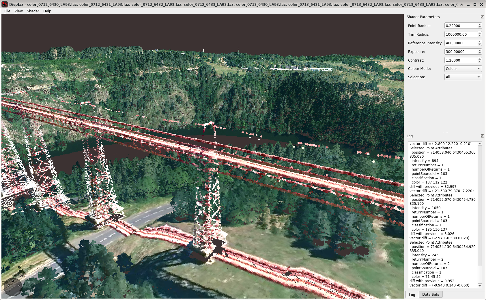

LiDarPaint
==========

### Qu'est ce que c'est ?

Ces scripts colorisent automatiquement des dalles Lidar HD IGN quelconques à partir des données d'orthophotographie distribuées également par l'IGN, ou par d'autres services.

Le script principal `painturl` récupère les fichiers IGN `.laz` directement à partir de leur URL et s'occupe de tous les traitements, produisant des fichiers color*.laz directement chargeables dans le logiciel displaz.

L'autre script `paintfile.py` travaille avec des fichiers .laz IGN déjà téléchargés et extraits qu'on lui fournit.

Cela permet d'avoir dans `displaz` des visualisations de ce type, comme ici le viaduc de Garabit :



Les URL des fichiers .laz sont à trouver sur cette page de l'IGN :
https://geoservices.ign.fr/lidarhd#telechargement

Ou directement :
* Pour les fichiers classifiés .laz : https://pcrs-dev.ign.fr/version_lidarhd_classe
* Pour les fichiers bruts .zip contenant des .laz : https://pcrs.ign.fr/version3

### Comment ça marche

Le script récupère les données 3D IGN, identifie la position géographique et va alors chercher les dalles 256x256 pixels d'orthophotographie aérienne correspondantes.

Il les assemble ensuite en une image de 1000 x 1000 mètres + marges en coordonnées de l'API IGN (WebMercator ou Lambert93), puis la convertit si nécessaire en coordonnées Lambert93 utilisées par les dalles Lidar.

Il projette enfin l'image 2D sur l'image Lidar 3D, produisant le fichier final `.laz` utilisable.

### Configuration initiale

La configuration se réalise maintenant par le fichier `lidarpaint.json`.

La seule configuration indispensable est d'adapter les entrées suivantes de `lidarpaint.json` pour les chemins des logiciels externes :

* `pdal_path`
* `gdalwarp_path`
* `gdal_translate_path`

Vous pouvez aussi modifier `default_layer` pour essayer d'autres jeux d'imagerie proposés par l'IGN, voire d'autres serveurs WMTS.

Quelques exemples sont fournis.

La configuration par défaut ('PM' = images en projection WebMercator, niveau de zoom 19) semble donner de meilleurs résultats que les images en projection Lambert93 native: meilleure résolution et images plus compactes.

### Exemple d'utilisation

Pour découvrir Monistrol d'Allier en 3D :

`./painturl 'https://wxs.ign.fr/c90xknypoz1flvgojchbphgt/telechargement/prepackage/LIDARHD_PACK_MN_2021$LIDARHD_1-0_LAZ_MN-0750_6431-2021/file/LIDARHD_1-0_LAZ_MN-0750_6431-2021.7z'`
`displaz *.laz`

Pour voir la gare de Saint-Chély d'Apcher :

`wget https://storage.sbg.cloud.ovh.net/v1/AUTH_63234f509d6048bca3c9fd7928720ca1/ppk-lidar/LN/LHD_C_LA93-IGN69_0721-6412_2022.copc.laz`
`./paintfile.py LHD_C_LA93-IGN69_0721-6412_2022.copc.laz`

Le programme supprime après usage les fichiers volumineux qui ne sont plus nécessaires.

Pour éviter de re-télécharger une zone, il est possible de re-coloriser
une dalle .laz déjà colorisée en la redonnant à `paintfile`. Cela
permet de tester un changement de couche orthophotographique :

`./paintfile.py color_0750_6431_LA93.laz`

### Configuration avancée

Le code sait gérer 3 protocoles correspondant à 3 types de serveurs de cartographie.

Par ordre chronologique de création de ces protocoles :

* TMS (Tile Map Service), le protocole d'origine OpenStreetMap ;
* WMTS (Web Map Tile Service), normalisé par l'OpenGIS Consortium et inspiré de TMS ;
* WMS (Web Map Service), une modernisation/généralisation de WMTS.

Le protocole le plus rapide et efficace est WMS, car il permet de récupérer des images de grande taille et éventuellement déjà géoréférencées. C'est lui qui est utilisé dans la configuration par défaut.

Le fichier de configuration permet de distinguer ces protocoles à l'aide du champ `protocol`.

Dans le cas de WMS et WMTS, le serveur fournit la liste des couches et formats disponibles. `paintfile.py` affiche cette liste avant de procéder à la récupération des images.

#### Configuration WMS

Exemple d'entrée pour utiliser le service WMS IGN avec la couche haute résolution :
```
        "IGN-HR": {
            "protocol": "wms",
            "layer": "HR.ORTHOIMAGERY.ORTHOPHOTOS"
            "crs": "EPSG:4326",
            "key": "ortho",
            "endpoint_url": "https://wxs.ign.fr/%(key)s/geoportail/r/wms?",
        },
```

Le champ `crs` indique la projection dans laquelle `paintfile.py` va spécifier les coordonnées au serveur. Cette projection doit être connue par ce dernier.

#### Configuration WMTS

Exemple d'entrée pour configurer le service WMTS IGN avec la couche haute résolution, pour des photos en projection Lambert93.
Ce n'est pas la clé d'accès `key` qui spécifie ici la projection, mais les paramètres de la couche sur le serveur, récupérés dynamiquement par `paintfile.py`.

Avec le protocole WMTS, il est nécessaire de spécifier le niveau de zoom désiré. Le niveau 18 ou 19 est généralement suffisant par rapport à la résolution des dalles Lidar IGN.

```
        "LAMB93": {
            "protocol": "wmts",
            "zoom": "18",
            "layer": "HR.ORTHOIMAGERY.ORTHOPHOTOS.L93",
            "key": "lambert93",
            "endpoint_url": "https://wxs.ign.fr/%(key)s/geoportail/wmts?"
        },
```


#### Configuration TMS

Ce protocole est surtout intéressant pour les contributeurs OpenStreetMap.

`paintfile.py` permet d'utiliser les mêmes cartes et avec la même syntaxe d'URL que celles fournies par les logiciels permettant la contribution.

Attention : ces cartes sont souvent soumises à des conditions d'utilisation qui en limitent l'usage à la contribution OpenStreetMap. Les utilisateurs sont donc invités à vérifier que l'usage qu'ils souhaitent faire des dalles Lidar ainsi colorisées est conforme aux conditions.

C'est la raison pour laquelle, dans le doute, aucune carte TMS préconfigurée n'est fournie dans le fichier d'exemple.

Les dalles Lidar peuvent avoir un grand intérêt en contribution cartographique, notamment afin de qualifier des éléments difficiles à distinguer sur la cartographie aérienne 2D : ponts, passerelles, passages souterrains ou supérieurs, etc.

```
        "OSM-OSM": {
            "protocol": "tms",
            "zoom": 18,
            "endpoint_url" : "https://tile.openstreetmap.org/{zoom}/{x}/{y}.png"
        },
```

Code en licence BSD.

Pierre Beyssac -- 2022-2023
Twitter: @pbeyssac
Mastodon: @pb@mast.eu.org

Les scripts ont été écrits pour Unix mais pourraient fonctionner sur d'autres systèmes, "sur un malentendu".

Les erreurs `proj_create_from_database: crs not found` ou
`(pdal pipeline readers.las Error) GDAL failure (1) PROJ: proj_create_from_database: crs not found`
semblent bénignes (?) et n'empêchent pas le calcul.

Logiciels nécessaires :
* GDAL
* PDAL
* wget
* 7zz
* Python >= 3.9

Modules Python :
* requests
* pyproj
* Pillow (PIL)

Pour l'affichage :
* `displaz`, `CloudCompare`, ...

Displaz doit être configuré avec :
* Colour Mode = color
* Exposure = de 250 à 350 suivant le cas
* et Point Radius = 0,20 donne un résultat plus lisse en vue rapprochée
